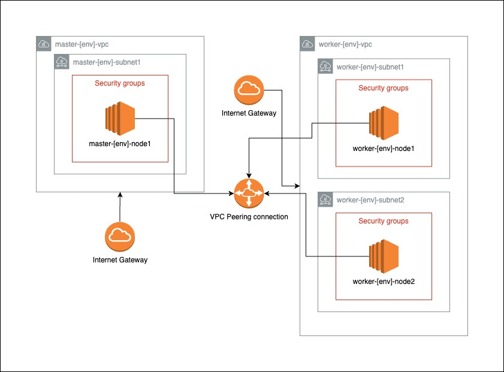
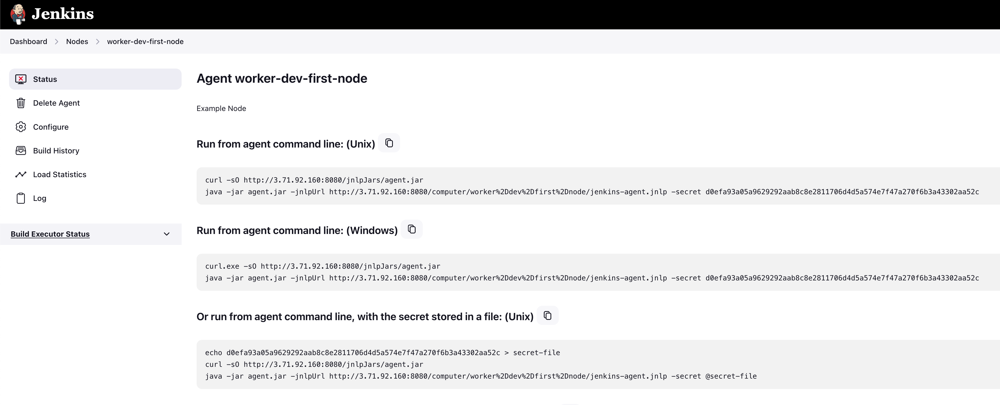

# Jenkins Distributed Architecture

## Overview

This project leverages a Jenkins distributed architecture, enhanced by Terraform for efficient infrastructure management and Ansible for seamless node provisioning. The setup features a master node and multiple slave nodes, designed to optimize CI/CD processes through scalable and flexible task distribution. 
 
 
By utilizing Terraform, we automate cloud resource provisioning, while Ansible ensures consistent configuration across all nodes. This architecture not only accelerates development cycles by efficiently managing workloads but also improves reliability and scalability, catering to the dynamic demands of modern software projects.

## Architecture Diagram

## Setting Up the Infrastructure

Follow the steps in [Infrastructure](./infrastructure/README.md) to set up the infrastructure using Terraform.

## Provisioning with Ansible

After setting up the infrastructure, provision the servers using the steps described in [Provisioning](./provisioning/README.md).

## Registering Jenkins Agents
To scale Jenkins operations, agents can be dynamically registered from each EC2 node. This process allows for a more flexible and scalable CI/CD infrastructure, enabling Jenkins to distribute tasks across multiple environments efficiently.

#### Quick Steps:  

<b>Jenkins Dashboard</b>: Access the Jenkins UI on your master node.
Agent Registration: Navigate to the nodes page where you will see the commands to run, Dashboard -> Nodes -> worker-dev-first-node/worker-dev-second-node:

Execute on EC2: Run these commands directly on your EC2 instances to register them as Jenkins agents, ensuring they're connected and ready for task distribution.

---

This guide provides an overview of setting up a Jenkins master-slave architecture. For specific details and advanced configurations, refer to the Jenkins documentation or other detailed guides.
