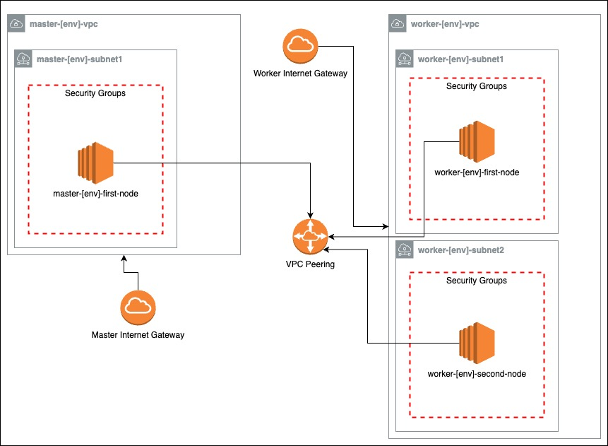
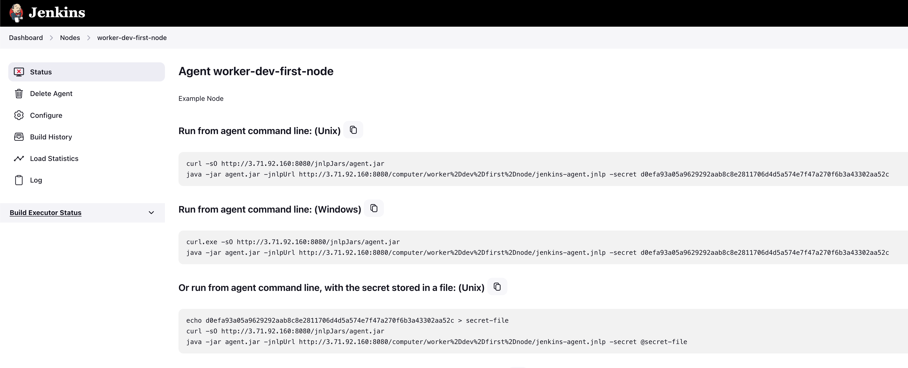

# Jenkins Distributed Architecture

Terraform + Ansible blueprint for a scalable Jenkins controller/agent architecture on AWS.

## Overview

This project leverages a Jenkins distributed architecture, enhanced by Terraform for efficient infrastructure provisioning and Ansible for seamless Jenkins deployment/configuration. The setup features a master node and multiple slave nodes, designed to optimize CI/CD processes through scalable and flexible task distribution. 
 
 
By utilizing Terraform, I automate cloud resource provisioning, while Ansible ensures consistent Jenkins deployment and configuration across all nodes. This architecture not only accelerates development cycles by efficiently managing workloads but also improves reliability and scalability, catering to the dynamic demands of modern software projects.

## Architecture Diagram

## Infrastructure Provisioning (Terraform)

Follow the steps in [Provisioning](./provisioning/README.md) to stand up the AWS infrastructure with Terraform.

## Jenkins Deployment (Ansible)

After provisioning the infrastructure, deploy and configure Jenkins using the steps described in [Deployment](./deployment/README.md).

## Registering Jenkins Agents
To scale Jenkins operations, agents can be dynamically registered from each EC2 node. This process allows for a more flexible and scalable CI/CD deployment, enabling Jenkins to distribute tasks across multiple environments efficiently.

#### Quick Steps:  

<b>Jenkins Dashboard</b>: Access the Jenkins UI on your master node.
Agent Registration: Navigate to the nodes page where you will see the commands to run, Dashboard -> Nodes -> worker-dev-first-node/worker-dev-second-node:

Execute on EC2: Run these commands directly on your EC2 instances to register them as Jenkins agents, ensuring they're connected and ready for task distribution.

---

This guide provides an overview of setting up a Jenkins master-slave architecture. For specific details and advanced configurations, refer to the Jenkins documentation or other detailed guides.
