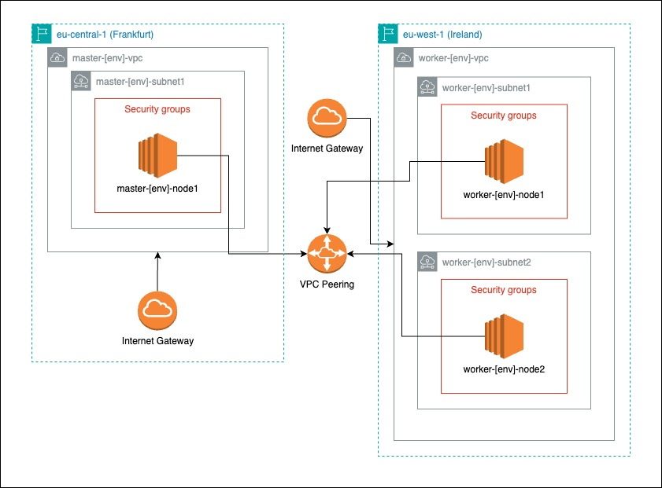

# Jenkins Distributed Architecture

## Overview

This project sets up a Jenkins distributed architecture using Terraform for infrastructure management and Ansible for provisioning. The setup includes a Jenkins master node and several slave nodes to efficiently manage and scale CI/CD tasks.

## Architecture Diagram

## Setting Up the Infrastructure

Follow the steps in [Infrastructure](./infrastructure/README.md) to set up the infrastructure using Terraform.

## Provisioning with Ansible

After setting up the infrastructure, provision the servers using the steps described in [Provisioning](./provisioning/README.md).

## Registering Jenkins Agents
To scale Jenkins operations, agents can be dynamically registered from each EC2 node. This process allows for a more flexible and scalable CI/CD infrastructure, enabling Jenkins to distribute tasks across multiple environments efficiently.

#### Quick Steps:  

<b>Jenkins Dashboard</b>: Access the Jenkins UI on your master node.
Agent Registration: Navigate to the nodes page where you will see the commands to run, Dashboard -> Nodes -> worker-dev-first-node/worker-dev-second-node:

Execute on EC2: Run these commands directly on your EC2 instances to register them as Jenkins agents, ensuring they're connected and ready for task distribution.

---

This guide provides an overview of setting up a Jenkins master-slave architecture. For specific details and advanced configurations, refer to the Jenkins documentation or other detailed guides.
